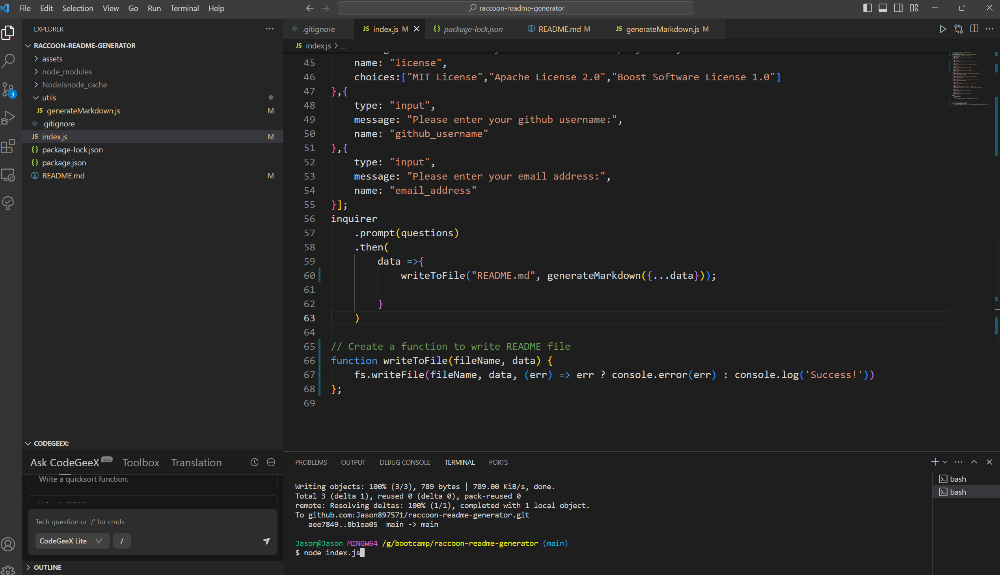

# raccoon-readme-generator

  [](https://opensource.org/licenses/MIT)
  
  ## Description
  
  - The motivation for this project is:As a project developer, I need a high quality professional readme file to intruduce my project.
  - The reason why I build this project is:It can save my time to create a readme file.
  - The problem this project solved is:I don't need to write markdown readme file from scratch. It saves developer's time.
  - What I learnt from this project is:I learnt how to use node enviroment to create a project by using inquirer and fs modules.
  
  
  ---
  ## Table of Contents
  
  If your README is long, add a table of contents to make it easy for users to find what they need.
  
  - [Installation](#installation)
  - [Usage](#usage)
  - [Credits](#credits)
  - [License](#license)
  - [Questions](#questions)
  - [Tests](#tests)
  
  ---
  ## Installation
  You should follow the three instructions below:
  
  1. Get a free API Key at [github](https://github.com/Jason897571/raccoon-readme-generator#built-with)
  2. Clone the repo
     ```sh
     git clone https://github.com/Jason897571/raccoon-readme-generator.git
     ```
  3. Open the project using vs code and run it in browser
  
  
  ---
  ## Usage
  When you open the project in your browser, you will see the following page.
  
  In the terminal, you should enter node index.js to run the generator. Then you need to aswer all the questions in terminal to generate a readme file.
  
  
  
  
  ---
  ## Credits
  
  * Salvatore Mammoliti - Email - mammoliti.sam@gmail.com
  
  * https://gist.github.com/lukas-h/2a5d00690736b4c3a7ba
  
  
  ---
  ## License
  
  [MIT License](https://choosealicense.com/licenses/mit/)
  
  Copyright (c) [2024] [Jason897571]

      Permission is hereby granted, free of charge, to any person obtaining a copy
      of this software and associated documentation files (the "Software"), to deal
      in the Software without restriction, including without limitation the rights
      to use, copy, modify, merge, publish, distribute, sublicense, and/or sell
      copies of the Software, and to permit persons to whom the Software is
      furnished to do so, subject to the following conditions:
      
      The above copyright notice and this permission notice shall be included in all
      copies or substantial portions of the Software.
      
      THE SOFTWARE IS PROVIDED "AS IS", WITHOUT WARRANTY OF ANY KIND, EXPRESS OR
      IMPLIED, INCLUDING BUT NOT LIMITED TO THE WARRANTIES OF MERCHANTABILITY,
      FITNESS FOR A PARTICULAR PURPOSE AND NONINFRINGEMENT. IN NO EVENT SHALL THE
      AUTHORS OR COPYRIGHT HOLDERS BE LIABLE FOR ANY CLAIM, DAMAGES OR OTHER
      LIABILITY, WHETHER IN AN ACTION OF CONTRACT, TORT OR OTHERWISE, ARISING FROM,
      OUT OF OR IN CONNECTION WITH THE SOFTWARE OR THE USE OR OTHER DEALINGS IN THE SOFTWARE.
  
  
  ---
  ## Questions
  
  If you have any questions about the repo, open an issue or contact me directly. You can find this repo at [https://github.com/Jason897571/raccoon-readme-generator](https://github.com/Jason897571/raccoon-readme-generator)
  
  #### Additional questions
  
  if you have additional quesitons, please feel free to reach me out at king.gs1314@outlook.com
  
  ---
  ## Tests
  
  You can test it by input node index.js in your terminal and then answer all the questions in terminal.