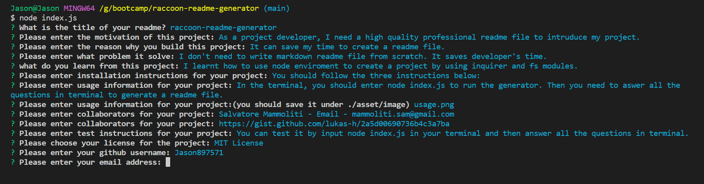

<a id="readme-top"></a>


<div align="center">
  <a href="https://github.com/Jason897571/raccoon-readme-generator">
    
  </a>

  <h3 align="center">Raccoon Readme Generator</h3>

  <p align="center">
    This is an efficient tool to create a professional readme file <br />With Help of this project, you would save a lot of time and make more effort on your project
    <br />
    <a href="https://github.com/Jason897571/raccoon-readme-generator"><strong>Click here for Github Repo  »</strong></a>
    <br />
    <br />
    <a href="">Video WalkThrough</a>
    ·
    <a href="https://github.com/Jason897571/raccoon-readme-generator/issues">Report Bug</a>
    ·
    <a href="https://github.com/Jason897571/raccoon-readme-generator/issues">Request Feature</a>
  </p>
</div>

<!-- TABLE OF CONTENTS -->
<details>
  <summary>Navigation of Contents</summary>
  <ol>
    <li>
      <a href="#about-the-project">About The Project</a>
      <ul>
        <li><a href="#built-with">Built With</a></li>
      </ul>
    </li>
    <li>
      <a href="#getting-started">Getting Started</a>
      <ul>
        <li><a href="#prerequisites">Prerequisites</a></li>
        <li><a href="#installation">Installation</a></li>
      </ul>
    </li>
    <li><a href="#usage">Usage</a></li>
    <li><a href="#contact">Contact</a></li>
    <li><a href="#future_additions">Future Additions</a></li>
    <li><a href="#reference">Reference</a></li>
  </ol>
</details>

<a id="#about-the-project"></a>
## About The Project

<p><strong>Start Page</strong></p>


<br />

This is a time manager that allows you to track your time spent on projects and tasks.


<a id="#built-with"></a>
## Built with
This generator is made with Javascript.

* 

<p align="right">(<a href="#readme-top">back to top</a>)</p>

<a id="getting_started"></a>
## Getting Started

This is an example of how you may give instructions on setting up your project locally.
To get a local copy up and running follow these simple example steps.

<a id="prerequisities"></a>
### Prerequisites

You should have your shell ready for downloading this project. We use gitbash as an example in this project

<a id="installation"></a>
### Installation
1. Get a free API Key at [github](https://github.com/Jason897571/raccoon-readme-generator#built-with)
2. Clone the repo
   ```sh
   git clone https://github.com/Jason897571/raccoon-readme-generator.git
   ```
3. Open the project using vs code and input node index.js in your terminal

4. Answer all the questions and get the readme file named as README-DEMO.md


<p align="right">(<a href="#readme-top">back to top</a>)</p>


<a id="usage"></a>
## Usage

When you open the project in code editor and go to index.js, you will see the following page.
Open your terminal and input node index.js


After clicking enter, you are asked questions regarding your project. Please fill them out!


After all the questions are answered, you will see a new readme file named as README-DEMO.md in your explorer, and the terminal shows "success!"


For more details, please refer to the [Documentation](https://github.com/Jason897571/raccoon-readme-generator)

<p align="right">(<a href="#readme-top">back to top</a>)</p>


<a id="future_additions"></a>
## Future Additions
* Provide more options for user to choose
* Add saving system. Whenever the user paused on any questions, he can come back later


<p align="right">(<a href="#readme-top">back to top</a>)</p>


<a id="contact"></a>
## Contact

Jason Gu - [Email](king.gs1314@outlook.com) - king.gs1314@outlook.com

Project Link: [https://github.com/Jason897571/raccoon-readme-generator](https://github.com/Jason897571/raccoon-readme-generator)

<p align="right">(<a href="#readme-top">back to top</a>)</p>

<a id="reference"></a>
## Reference
* Xpert Assistant/ChatGPT
* https://dev.to/envoy_/150-badges-for-github-pnk#games
* https://github.com/othneildrew/Best-README-Template


<p align="right">(<a href="#readme-top">back to top</a>)</p>

<!-- MARKDOWN LINKS & IMAGES -->
<!-- https://www.markdownguide.org/basic-syntax/#reference-style-links -->
[Javascript-url]:https://img.shields.io/badge/JavaScript-F7DF1E?style=for-the-badge&logo=javascript&logoColor=black
